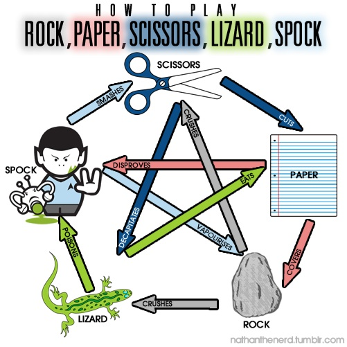

 # Contents 
 
 - [Introduction](#Introduction)
 - [Problems](#Problems)
 - [Material](#Material)
 - [Screenshot](#Screenshot)
 - [Images](#Images)
 - [Youtube Videos](#Youtube-Videos)
 - [Links](#Links)

# Introduction

## Problems 

Most of my problems that I have had, has been to centering my pictures and videos.
At first, I had problems finding the right size. This was my least problem.
After I needed to make them responsive to the display, I had problem finding the right code to get it right.
It wasn´t until I started using "rem" instead of "em" that I got text sizes that i liked.
When I started using % instead of px, I found I got the sizes I wanted more easily.

But learning how to Center a picture. Or to make it Flex. That must have been the hardest to figure out during this project.

Much of what I learned my Html and CSS coding was from watching Kevin Powell´s Youtube videos on the subject.
I learned from there how some CSS coding make some things easier and how I could apply it to my current project.
And hopefully to my future projects.
He is also the one who taught me to stop coding in Chrome and start coding in Firefox instead.
I will leave a link to the first video for beginners, down in the Youtube section.

He even recommended to make 'Chapters' in ones CSS. For easy finding of different things in the CSS code.
Just press Ctrl + F and search for the targeted name.

***

## Material

### Screenshot

### Images

 

- - - - -- - - - -- - - - -- - - - -

### Youtube Videos

### Links

[Freecodecamp - 40 JavaScript Projects for Beginners](https://www.freecodecamp.org/news/javascript-projects-for-beginners/#how-to-create-a-color-flipper)
